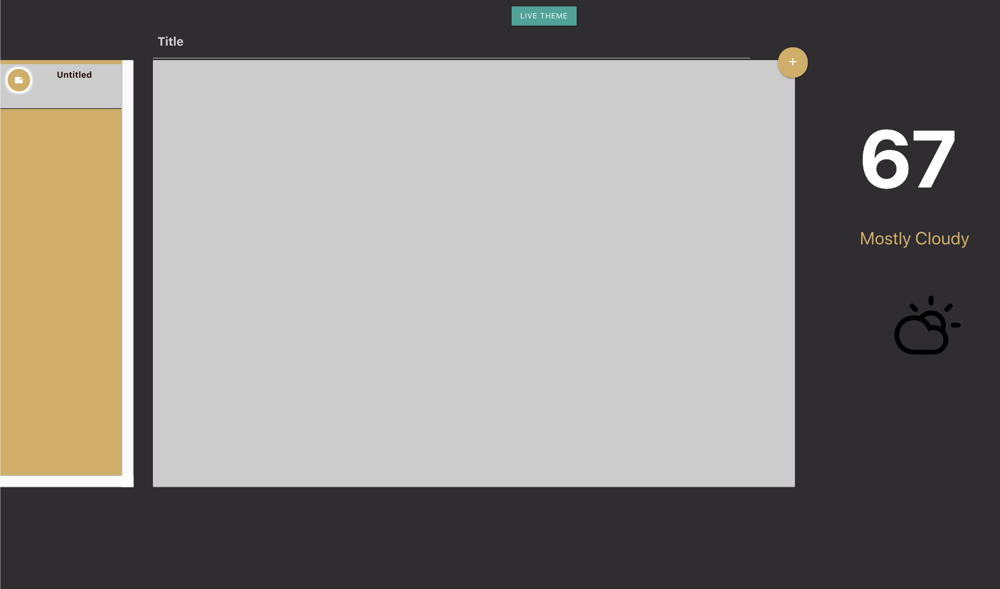

# Notepad

### Notepad is a relaxing note-taking app that changes it's visual theme based on the time and weather.

[Link to repository for the frontend](https://github.com/ajsultanov/notepad-frontend)

> TK demo video/link

#### Made with:
- React
  - Hooks
  - Context
- Custom CSS
- Dark Sky API
- Rails API
- Postgres

After signing in a user is able to create, edit, and delete notes in their collection. Notes have themes that change depending on the weather conditions and time of day at the user's location. These themes are saved with the notes themselves.
